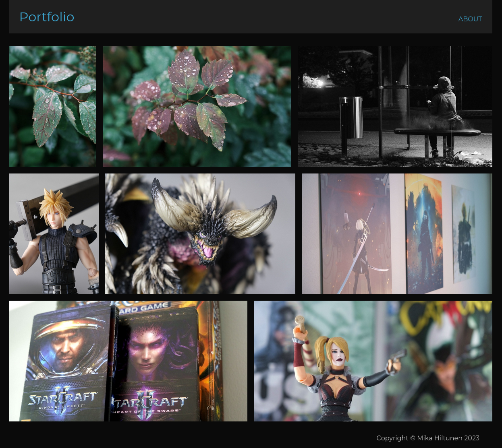

# Minimalistic Photograpy Portfolio

Minimalistic portfolio app made with [Go](https://go.dev/). If you don't want to play with databases or complex album hierarchies, this is for you.

This app is build around the file system, eliminating the need for an admin UI. It also simplifies the process of backing up and restoring your data.

## Features
- File based - no databases needed!
- Automagic thumbnail generation
- Atom feed

## Setup

To get started, follow these steps:

1. Clone the repository with
```bash
git clone https://github.com/saaste/portfolio.git
```


2. Copy the two example files to their respective names:
- [settings.yaml.sample](settings.yaml.sample) ➔ `settings.yaml`
- [docker-compose.yaml.example](docker-compose.yaml.example) ➔ `docker-compose.yaml`

3. Adjust the settings in the newly created `settings.yaml` file according to your preferences. Here is a
breakdown of the settings you can customize:

| Setting           | Description
|------------------ | -------------------------------------------------
| smallSize         | Maximum size for small thumbnails 
| mediumSize        | Maximum size for medium thumbnails 
| refreshInterval   | How often photos are refreshed (e.g 10s, 15m, 1h)
| title             | Title of the portfolio
| author            | Author of the photos
| about             | Text for the `About` page. HTML tags are allowed

4. Optionally, you can also customize the templates and CSS files located in the `ui` directory. Keep in
mind that these files are in the source control.

## How to run

### Running with Go
The only requirement is [Go](https://go.dev/). You can start the app with:
```
go run main.go
```

The app will run on port 8000.

### Running with Docker
The only requirement is [Docker](https://www.docker.com/). You can start the app with:
```
docker-compose up
```

By default, the app listens on port 8000. You can modify the port in the `docker-compose.yaml` file.

### Refreshing thumbnails
The app automatically generates small and medium thumbnails for each new image. If you want to refresh
thumbnails for all existing images, you can use the following command:
```
go run main.go --generate-thumbnails
```

## Adding images
To add new images, simple place them in the `files` directory. The app will periodically check for new
images based on the `refreshInterval` setting. If you wish to see the new images immediately, restart
the app.

Please note that only JPG and PNG formats are supported.

## Preview

